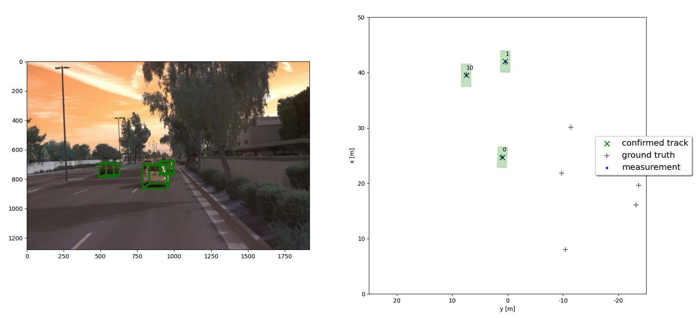

# Writeup: Track 3D-Objects Over Time

Please use this starter template to answer the following questions:

### 1. Write a short recap of the four tracking steps and what you implemented there (filter, track management, association, camera fusion). Which results did you achieve? Which part of the project was most difficult for you to complete, and why?
The final project involved implementing Extended Kalman Filter, track management, data association and fusion of the lidar and camera sensors.
# Extended Kalman Filter
EKF mainly consists of 2 steps - prediction of the next step and update with new measurement. Prediction allows to roughly estimate the next position of the tracking object. The update step improves the confidence of tracking.
For predict(), system matrix F and noise covariance Q needed to be implemented.
For update(), gamma residual and S residual covariance were needed.
The achieved result was the RMSE mean value of 0.30.

 

 

# Track Management
Track management step allows to initialise, delete tracks, set a track state and score.
In the first step, initialise, a new track is created for the new object. Deletion of track is accomplished by removing the confirmed track if the conditions are satisfied. Updating track state involves transiting between initialised, tentative and confirmed states. Updating track score is done by either increasing or decreasing the confidence score of the object.
Final RMSE is 0.78.

 

# Association
In this step, a multi-target tracking is accomplished. Each measurement will be associated with the relevant track by means of a single nearest neighbor data association. 
The association step is done by initialising an association matrix based on Mahalanobis distance formula. Gating functionality would check whether the measurement lies inside a track's gate. The algorithm of single nearest neighbor is implemented by finding the minimum entry in association matrix, deleting corresponsing row and column, assigning a measurement to relevant track and returning the track measurement pair. 
As a result, 3 vehicles were identified and confirmed, and the maximum RMSEs of 3 tracks was 0.19.

 

 

# Camera Fusion
The final part of the project is to fuse camera and lidar measurements.
First, the algorithm checks if the object is in the field of sensor view. It is required to transform the vehicle position coordinates to camera coordinates. Next, projection from camera to image coordinates is needed.
Camera measurement object has to be initialised using vector z, noise covariance R. By the end, there were 3 confirmed tracks identified with the maximum RMSE of 0.17, which is better than in previous step.
Last part of the project was the most difficult due to non obvious enabling the camera measurements. 

 

### 2. Do you see any benefits in camera-lidar fusion compared to lidar-only tracking (in theory and in your concrete results)? 
There is a benefit in using camera-lidar fusion due to faster confirmation time. The track confidence score increases faster when camera and lidar are used. Furthermore, this helps to ignore false detections quicker. 
From the actual results, it can be seen that RMSE value for camera-lidar system is lower, which means a better performance.

### 3. Which challenges will a sensor fusion system face in real-life scenarios? Did you see any of these challenges in the project?
Real-world challenges include weather conditions, multiple object detection, varying vehicle velocity and others. 
Weather could make it harder to detect objects and more time would be needed to transit between track states. In real scenario, there would be more objects than just vehicle, for example pedestrians, cyclists, road signs etc. The system should be able to cope with the amount of data to process. In this project the system didn't account for varying velocity of the vehicle. This would lead to decreased performance.

### 4. Can you think of ways to improve your tracking results in the future?
Things to improve:
1. Better association alforithm - Probabilistic Data Association.
2. Testing under various road conditions. 
3. Using more sensors around the vehicle. 

